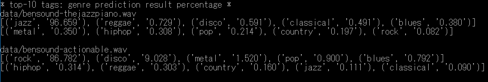
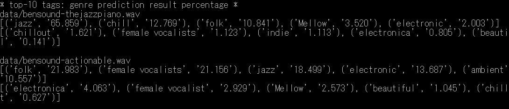

# 音楽のジャンル分け

## 概要  

音楽のジャンル分け（タグ付け）としてChoi氏の[Music auto-tagging using keras](https://github.com/keunwoochoi/music-auto_tagging-keras)がある。  
ここでは、その派生でジャンル数を50から10へ変更した [Music Genre Classification with Deep Learning](https://github.com/jsalbert/Music-Genre-Classification-with-Deep-Learning)の  
CRNNモデルをChainer用にリメイクする。 

[github repository](https://github.com/shun60s/music-tagging-chainer)  

## 互換性の問題  

#### gru
オリジナルで使われているKeras/TheanoとChainerの間ではGRUの計算式が異なる。
GRUは、Keras/Theanoに似せた計算式へ変更したものを準備した。（gru2.py)   

#### Batch Normalization(BN)
Batch Normalization(BN) については、移動平均の方法や定数が異なるところがあり、Chainer対応してもまったく同じ動作にならない。
暫定として平均値と分散の初期値を設定できるものを準備した。(batch_normalization2.py)  
Keras 1.0.6とそれ以降では、BNに互換性が無い（挙動が違う）ようである。CNNモデルの方は1.0.6でないと正しく動かない。CNNモデルは分散の値を２乗するように変更した。  
美しくないが、Kerasの BNのmode=2に似た動作にするため、テスト時に動的にBNを計算するためのフラグも追加した。  
 
### conv
保存されたconv層の重み係数の配置が逆になっている。  

### その他の留意点
windows上でのTheano optimization failedを回避するため、  
```
import theano  
theano.config.optimizer='None'  
```
をオリジナルに追加して動作確認した。  


## 音楽のジャンル分け  

Music Genre Classification with Deep LearningのCRNNモデル（ジャンル数10）と  
Music auto-tagging using kerasの初期のCNNモデル（BNにmode2を使っているもの、ジャンル数50）仮称CNN0モデルと、  
Music auto-tagging using kerasのCNNモデル（その後BNがmode=0に変更されている）の3種類の重みを使って2曲の予測実験をしてみた。  
CNNモデルの結果は不安定？でどことなく怪しいところがあるような気がしている。  

### CRNNモデルによる予測の結果の例

```
python3 music-tagger-test.py
```

  


### CNNモデルによる予測の結果の例

```
python3 music-tagger-test.py -m CNN0
```

  

```
python3 music-tagger-test.py -m CNN
```

  


## 内容

- h5_load.py  githubで公開されているkeras用の重みファイルを読み込むためのもの。
- music-tagger-test.py   引数に　--en　を追加するとkeras用の重みファイルを読み込む。テストする曲を変更するときはaudio_pathsを書き換える。
- /data  Chainer用の重みモデルファイルなど。


## 参照したもの  

- [Music auto-tagging using kerasの初期のリポジトリ](https://github.com/keunwoochoi/music-auto_tagging-keras/tree/90b294091adaada477b9003201dd20a9fe15a3c1)
- [Music Genre Classification with Deep Learning](https://github.com/jsalbert/Music-Genre-Classification-with-Deep-Learning)
- [GTZAN Genre Collection, Data Set](http://marsyasweb.appspot.com/download/data_sets/)　10分類各100個、合計1000個の音源セット（長さは30秒）
- [ROYALTY FREE MUSIC by BENSOUND](https://www.bensound.com/)　ここからのサンプル音源が付属していた。


## ライセンス  
docsディレクトリーの中にある以下のオリジナルのライセンス文を参照のこと。   
LICENSE-music-auto_tagging-keras.md  
LICENSE-chainer.txt  


